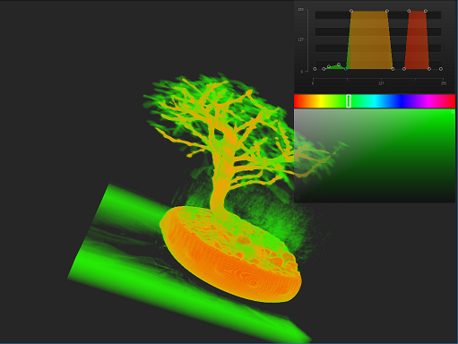

# README #

Volume Rendering application using Compute shader with OpenGL.

## Project Configuration ##
- Need GLFW, stb_image, GLM, and GLAD. 
- Add include folder with all .h files, lib folder with al .lib files and the .dll files in the root folder.
- Only volume raw file format supported by now.


## Executable Parameters #
The program can run without any parameters and will load a volume of size 256x256x256 localed in "./RAW/volume.raw". Some parameters can be passed to the program in the following way: 

```sh
$ program <volume_path> <width> <height> <depth> <bits> <scalex> <scaley> <scalez> <number_of_working_items_X> <number_of_working_items_Y> [<transfer_func_path>]
```

where `<volume_path>` is the path of the file containing the volume; `<width>`, `<height>`, and `<depth>` the dimensions of the volume; `<bits>` the number of bits per scalar (only 8 and 16 bits supported); `<scalex>`, `<scaley>`, and `<scalez>` the scale of the volume in every direction; `<number_of_working_items_X>`, and `<number_of_working_items_Y>` the number of working items per working group, and `<transfer_function_path>` is the path of the file containing the initial set up of the transfer function. The last parameter is optional, in which case, the identity function is loaded.

## Set up of the Transfer Function File#

The file has the following configuration:

```sh
<num_points>
<scalar_value0> <r> <g> <b> <a>
<scalar_value1> <r> <g> <b> <a>
...
<scalar_valueN> <r> <g> <b> <a>
```

where  `<num_points>` is the number of points indicated. Then, for each point there are four float values, indicating the scalar value ([0, 255]) and the corresponding RGBA normalized color ([0.0f,1.0f] ) for that scalar value in ascending order. Color for scalar values no indicated in the file are interpolated. At least the first (scalar = 0) and the last (scalar = 255) values must be indicated.


## External Libraries and Compilation

The following externa libraries/ projects were used in the develop of this program:

* [GLFW 3.2](http://www.glfw.org/), for OpenGL context and window management.
* [glad](https://github.com/Dav1dde/glad), for OpenGL 4.5 extension loader.
* [OpenGL Mathematics (GLM)](http://glm.g-truc.net/), as a mathematic library.
* [STB Image 2.12](https://github.com/nothings/stb), for image loading.

To compile in Visual Studio, the header files must be put in a "include" folder as follows:

    - VRCompute/include/glad/ (glad files)
    - VRCompute/include/GLFW/ (GLFW files)
    - VRCompute/include/glm/ (GLM files)
	- VRCompute/include/KHR/ (file included with glad)
	- VRCompute/include/ (stb_image file)

The GLFW libs libraries must be set on a folder "lib" that must be organized as follows:

    - VRCompute/lib/x86/ (x86 libs)
	- VRCompute/lib/x64/ (x64 libs)
	
The project also uses a transfer function class that be obtained [here](https://github.com/franjaviersans/transfer-function-glfw3).

## Screenshots

The following is a screenshot of the program running:

<p align="center">
  
</p>